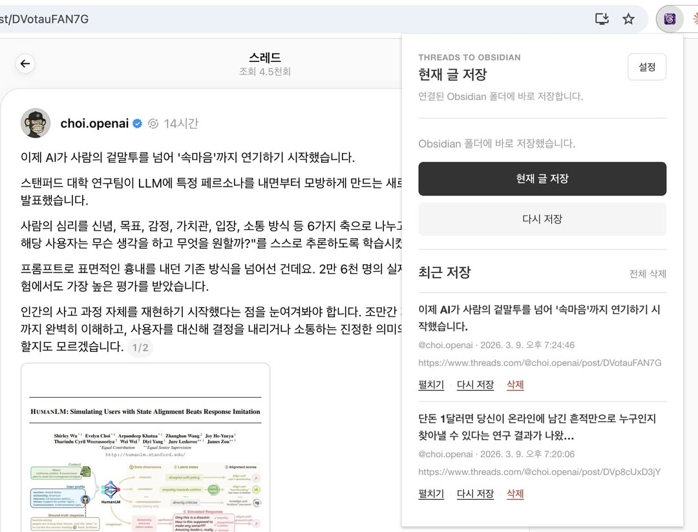
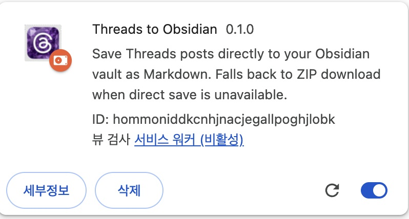
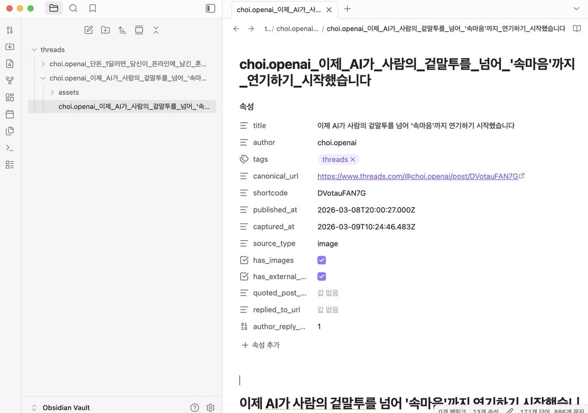

# Threads 글을 Obsidian에 마크다운으로 저장하는 크롬

원문: https://www.threads.com/@parktaejun/post/DVqWBh1AUSq
작성자: @parktaejun
게시 시각: 2026-03-09T11:14:31.000Z
외부 링크: http://github.com/parktaejun-dev/threads-to-obsidian

Threads 글을 Obsidian에 마크다운으로 저장하는 크롬 확장을 만들었습니다.

좋은 글을 발견하면 아이콘 한 번으로:

마크다운 파일로 Obsidian vault에 바로 저장(이미지와 연속글도 됩니다)

설치 방법 (1분):

- GitHub에서 ZIP 다운로드 후 압축 해제

- Chrome > chrome://extensions > 개발자 모드 ON(중요!)

- "압축해제된 확장 프로그램을 로드합니다" > dist/extension 폴더 선택

- Threads 글 페이지에서 확장 아이콘 클릭

- 코드 빌드 같은 거 필요 없습니다. 다운받고 폴더만 지정하면 됩니다.

필요하신 분들 써보시고, 개선의견 부탁드립니다.

GitHub:

## 이미지

