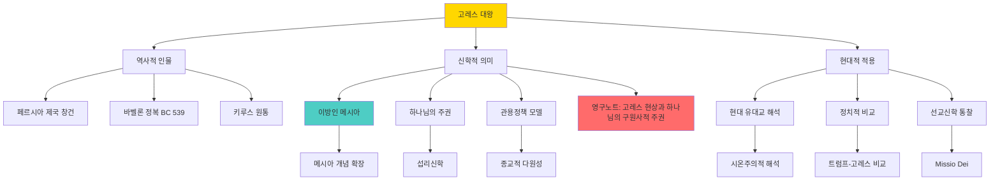

# 고레스 MOC

**생성일**: 2025-10-02
**최종 업데이트**: 2026-02-06

---

## 📋 개요

고레스(키루스) 대왕은 구약성경에서 유일하게 이방인으로서 "메시아"(기름부음 받은 자)라 불린 페르시아 제국의 창건자입니다. 그는 바벨론을 정복하고(BC 539) 유대인의 포로 귀환과 예루살렘 성전 재건을 허락함으로써 하나님의 구원사에서 핵심적 역할을 담당했습니다. 고레스 현상은 하나님의 구원 계획이 민족적 경계를 초월하며, 비신앙인도 하나님의 도구로 사용될 수 있음을 보여주는 신학적 혁명입니다.

---

## 🎯 핵심 개념

### 기초 개념
- [[이방인-메시아로서의-고레스]] - 메시아 개념의 혁명적 확장
- [[고레스-대왕-역사적-프로필]] - 역사적 배경과 정복 사업
- [[키루스-원통과-고고학적-증거]] - 고고학적 증거
- [[바벨론-포로귀환과-성전재건]] - 고레스의 칙령과 역사적 영향

### 심화 개념
- [[고레스의-관용정책과-종교자유]] - 종교적 관용의 모델
- [[고레스-예언에-대한-현대신학적-해석들]] - 예언 성취에 대한 다양한 해석
- [[고레스의-문명사적-유산과-현대적-영향]] - 역사적 유산과 영향

---

## 📚 이론 및 방법론

### 신학적 이론
- [[고레스-현상과-하나님의-구원사적-주권]] - 영구노트: 신학적 통합 분석
- [[섭리신학과-하나님의-주권]] - 역사 주관의 신학
- [[기술적-구원론-vs-은혜적-구원론]] - 은혜의 보편성

### 메시아론적 배경
- [[히브리어 마쉬아흐의 언어학적 진화]] - 메시아 용어의 발전
- [[고대 근동 왕권 이데올로기와 이스라엘 메시아 개념]] - 고대 근동적 배경
- [[포로 이후 종말론적 메시아주의의 발전]] - 메시아 개념의 발전
- [[삼중 해석 전통의 메시아론 비교 - 유대교, 기독교, 현대 학술]] - 해석 전통 비교
- [[탈무드의 메시아관 변화 - 고난받는 메시아에서 승리하는 메시아로]] - 유대교적 발전
- [[현대 성서학의 역사비평적 메시아 연구]] - 현대 학술적 접근

### 신학적 방법론
- [[성육신의-신학적-의미]] - 하나님의 역사 내 개입
- [[구약의 소명신학 비교연구]] - 소명 신학의 폭넓은 이해
- [[중보자 신학의 구약적 기초]] - 중보 개념의 구약적 토대

---

## 💡 적용 사례

### 현대 유대교의 해석
- [[현대-정통파-유대교의-고레스-메시아-지위-인정]] - 전통적 메시아 지위 유지
- [[정통파-유대교와-개혁-유대교의-고레스-이해-차이]] - 해석의 다양성
- [[현대-유대교의-고레스-시온주의적-해석]] - 민족주의적 재해석
- [[현대-유대교의-고레스-정치적-도구화-우려]] - 정치적 악용 우려

### 현대 정치적 적용
- [[네타냐후의-트럼프-고레스-비교론]] - 현대 정치 지도자와의 비교
- [[라비들의-현대-고레스-비교에-대한-신중한-접근]] - 신중한 적용 필요성
- [[현대-이스라엘과-이란의-복잡한-관계]] - 역설적 관계

### 선교 및 종교간 대화
- [[로마의 기독교 국교화와 관용의 상관관계]] - 관용과 권력의 관계
- [[기독교-예전의-역사적-발전과-현대적-혁신]] - 문화적 적응
- [[디지털-혁명과-온라인-예전의-전환]] - 현대적 상황화

### 역사적 비교 연구
- [[국가 즉 '공' 개념을 발견한 로마]] - 공공성 개념의 발전
- [[로마는 공화정 파시즘 체제]] - 권력 구조 분석
- [[로마를 사이에 두고 통합되고 분열되었던 세 개의 세계]] - 제국과 통합
- [[사비니 여인들]] - 통합의 상징적 사건
- [[강한 로마의 비밀은 ‘패배’를 패배로 끝내지 않는 데 있었다.|강한 로마의 비밀은 '패배'를 패배로 끝내지 않는 데 있었다]] - 회복탄력성
- [[도편 추방제]] - 민주주의와 권력 견제

---

## 🔍 비판 및 한계

### 신학적 긴장
- **보편주의 vs 특수주의**: 하나님의 보편적 사역과 교회의 특수한 사명의 관계
- **일반계시 vs 특별계시**: 고레스를 통한 하나님의 일하심의 성격
- **구원의 보편성 vs 복음의 유일성**: 이방인 메시아 개념의 신학적 함의

### 해석학적 논쟁
- 이사야 예언의 시기와 역사성 논쟁
- "메시아" 칭호의 의미와 범위
- 현대 정치 지도자와의 비교의 적절성

### 정치적 악용 위험
- 시온주의적 정치 도구화
- 권위주의 정당화의 위험
- 종교적 관용 개념의 왜곡

---

## 🗺️ 지식 지도

---

## 🔗 관련 MOC

- 메시아론-MOC - 메시아 개념의 전반적 발전 (생성 예정)
- 구원사-MOC - 구약의 구원사 전개 (생성 예정)
- 선교신학-MOC - 선교의 신학적 기초 (생성 예정)
- 종교간-대화-MOC - 타종교와의 대화 모델 (생성 예정)

---

## ❓ 지식 공백

- [ ] 고레스 이전의 이방 통치자들에 대한 구약의 평가 비교 연구
- [ ] 고레스의 개인적 종교관과 신앙에 대한 역사적 연구
- [ ] 에스라-느헤미야 시대의 고레스 칙령 실행 과정 상세 연구
- [ ] 제2성전기 유대교의 고레스 이해 발전 과정
- [ ] 초대교회의 고레스 해석과 이방인 선교의 연결점
- [ ] 이슬람의 키루스 이해와 기독교-이슬람 대화 가능성
- [ ] 현대 이란의 키루스 기념과 정치적 의미

---

## 🚀 다음 탐구 방향

1. **메시아론 전체 MOC 구축**: 고레스를 포함한 구약-신약의 메시아 개념 발전 전체 지도
2. **페르시아 시대 구약 문헌 연구**: 에스라, 느헤미야, 학개, 스가랴의 고레스 시대 배경 연구
3. **현대 정치신학 연구**: 비기독교 정부와의 협력, 정교분리, 공공선 추구의 신학적 기초
4. **종교간 대화 모델 개발**: 고레스의 관용정책을 현대 종교간 대화에 적용하는 실천적 모델
5. **선교 상황화 연구**: 복음의 본질과 문화적 적응의 균형점을 고레스 모델에서 배우기

---

**노트 수**: 47개
**마지막 검토**: 2026-02-06

---

## 📝 사용된 주요 노트 목록

### 문헌메모 (Literature Notes)
1. [[이방인-메시아로서의-고레스]]
2. [[고레스-대왕-역사적-프로필]]
3. [[바벨론-포로귀환과-성전재건]]
4. [[고레스의-관용정책과-종교자유]]
5. [[키루스-원통과-고고학적-증거]]
6. [[고레스-예언에-대한-현대신학적-해석들]]
7. [[고레스의-문명사적-유산과-현대적-영향]]
8. [[현대-정통파-유대교의-고레스-메시아-지위-인정]]
9. [[정통파-유대교와-개혁-유대교의-고레스-이해-차이]]
10. [[현대-유대교의-고레스-시온주의적-해석]]
11. [[현대-유대교의-고레스-정치적-도구화-우려]]
12. [[네타냐후의-트럼프-고레스-비교론]]
13. [[라비들의-현대-고레스-비교에-대한-신중한-접근]]
14. [[현대-이스라엘과-이란의-복잡한-관계]]
15. [[로마의 기독교 국교화와 관용의 상관관계]]
16. [[중보자 신학의 구약적 기초]]
17. [[성육신의-신학적-의미]]
18. [[기술적-구원론-vs-은혜적-구원론]]
19. [[구약의 소명신학 비교연구]]
20. [[디지털-혁명과-온라인-예전의-전환]]
21. [[고대 근동 왕권 이데올로기와 이스라엘 메시아 개념]]
22. [[포로 이후 종말론적 메시아주의의 발전]]
23. [[삼중 해석 전통의 메시아론 비교 - 유대교, 기독교, 현대 학술]]
24. [[현대 성서학의 역사비평적 메시아 연구]]
25. [[다윗 언약의 해석학적 문제 - 무조건적 vs 조건적 약속]]
26. [[국가 즉 '공' 개념을 발견한 로마]]
27. [[로마는 공화정 파시즘 체제]]
28. [[로마를 사이에 두고 통합되고 분열되었던 세 개의 세계]]
29. [[사비니 여인들]]
30. [[도편 추방제]]
31. [[민주주의는 포퓰리즘의 가능성을 전제한다]]
32. [[토크빌이 말한 민주주의의 그림자]]

### 영구메모 (Permanent Notes)
1. [[고레스-현상과-하나님의-구원사적-주권]] ⭐ 핵심 통합 노트
2. [[섭리신학과-하나님의-주권]]
3. [[기독교-예전의-역사적-발전과-현대적-혁신]]

### 임시메모 (Fleeting Notes)
1. [[키루스 대왕 - 관용과 전략의 제국 건설자]]
2. [[히브리어 마쉬아흐의 언어학적 진화]]
3. [[탈무드의 메시아관 변화 - 고난받는 메시아에서 승리하는 메시아로]]
4. [[위기 후의 확신 - 소명 재확인]]
5. [[협력과 연합(라바흐)의 영성]]

### 창작자료
1. [메시아로 불린 페르시아 왕 고레스](<../📁 4.Prolific_Lounge (창작작업장)/설교/수요성경공부/[수요성경공부] 메시아로 불린 페르시아 왕 고레스.md>) - 수요성경공부 자료
