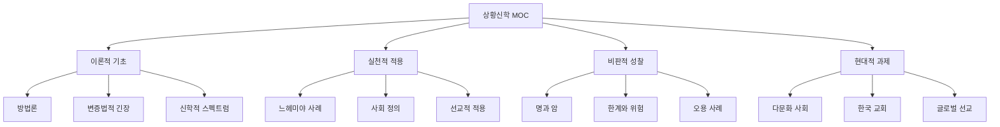

# 🗺️ 상황신학 (Contextual Theology) - Map of Content

**생성일**: 2025-10-22
**상태**: ✅ 완성

## 개요

상황신학(Contextual Theology)은 하나님의 말씀(Text)을 특정한 사회·문화적 상황(Context)에 정확하면서도 적절하게 전하고자 하는 지속적 행동이다. 이 MOC는 상황신학의 이론적 기초, 실천적 적용, 그리고 비판적 성찰을 체계적으로 정리한다.

**핵심 질문**:
- 어떻게 보편적 복음을 특수한 상황에 적용할 것인가?
- Text(성경)와 Context(상황) 사이의 긴장을 어떻게 관리할 것인가?
- 문화적 적합성과 신학적 정확성을 어떻게 균형잡을 것인가?

## 전체 구조

---

## 📚 핵심 개념 (Concept Notes)

### 상황화의 정의
- **정의**: 하나님의 말씀을 토양(문화, 상황)에 판단하여 바르게 심는 **동적(動的) 과정**
- **핵심**: 수동적 적응이 아닌 능동적 변혁
- **목표**: 정확성(Accuracy) + 적절성(Appropriateness)

### Text vs. Context의 변증법

| Text (본문) | Context (상황) |
|------------|---------------|
| 그때 (Then) | 지금 (Now) |
| 성서신학 | 선교신학 |
| 내용 (Contents) | 전달 (Delivery) |
| 해석 (Interpretation) | 적용 (Application) |
| 보편적 진리 | 특수한 상황 |

**핵심 긴장**: 이 둘은 대립이 아니라 **상호보완적 변증법** 관계

### 적절성(Appropriateness)의 기준
1. **문화적 적합성**: 해당 문화권에서 이해 가능한 형태
2. **신학적 정확성**: 복음의 본질 왜곡 없이 전달
3. **실천적 효용성**: 실제 삶의 형편 개선에 기여
4. **선교적 확장성**: 복음이 더 넓게 전파될 수 있는 방식

---

## 📖 주요 문헌메모 (Literature Notes)

### 이론적 기초

**[[상황신학의-방법론과-적용]]** (필독)
- Text와 Context의 변증법적 관계
- 자유주의 vs. 복음주의 상황화
- 적절성의 기준과 판단의 역동성
- 율법 준수보다 **율법이 삶의 형편을 어떻게 증진시키는가**에 초점

### 실천 사례 분석

**[[느헤미야-개혁의-명과-암-상황신학적-분석]]** (필독)
- **명(Light)**: 사회 정의, 자기희생적 리더십 → 보편적 윤리
- **암(Shadow)**: 배타성, 이방인 추방 → 맥락적 필연성의 한계
- 정의 실현과 경계 설정 사이의 변증법적 긴장
- 느헤미야 개혁의 일시성 문제

### 비교 연구

**[[발터벤야민의공부법_문헌메모]]**
- 맥락과 텍스트의 상호작용
- 역사적 유물론과 신학적 해석

**[[다석 유영모의 주기도문 해석학]]**
- 한국적 상황화의 모범
- 동양 사상과 기독교의 대화

---

## 💎 나의 통찰 (Permanent Notes)

### 리더십과 상황신학

**[[성경적-경제정의는-구조적-변화를-요구한다]]**
- 상황신학의 실천: 느헤미야 5장의 7단계 구조 변혁
- 자유주의적 상황화의 모범 (사회 정의 실현)
- 즉각적 희년: 50년을 기다리지 않는 상황적 적용

**[[리더의-청렴성은-공감에서-시작된다]]**
- 상황신학적 리더십: "이 백성의 짐이 중하므로"
- 상황에 대한 공감이 윤리적 실천의 근원
- 복음주의적 상황화의 기반 (신뢰 구축)

**[[진정한-리더십은-감정과-이성의-균형에서-나온다]]**
- 상황 인식 (사회적 인식) → 상황적 대응
- 감정적 공감과 전략적 사고의 통합

**[[기도와-행동은-분리될-수-없다]]**
- 상황신학의 영성: 기도 (Text) + 행동 (Context)
- 영적인 것과 실천적인 것의 통합

---

## 🌍 신학적 스펙트럼

### 1. 자유주의적 상황화

**초점**: 사회, 정치, 경제, 인권 분야
**목적**: 인간 삶의 형편과 상황 증진
**강조**: 구조적 변화, 사회 정의 실현

**대표 신학**:
- 해방신학 (Liberation Theology)
- 민중신학 (Minjung Theology)
- 흑인신학 (Black Theology)

**느헤미야에서의 예**:
- 경제 착취 구조 해체 (느 5장)
- 부유층에 대한 예언자적 분노
- 즉각적 희년 실행

### 2. 복음주의적 상황화

**초점**: 효과적인 복음 전달
**목적**: 듣는 대상자들의 문화 이해 바탕으로 효과적 복음 전파
**강조**: 복음의 순수성 유지, 문화적 적합성

**대표 운동**:
- 인사이드 무브먼트 (Insider Movement)
- 문화적 적합성 선교
- 토착화 신학

**느헤미야에서의 예**:
- 성벽 재건 → 자존감 회복 → 복음 전달 기반
- 말씀 중심 개혁 (느 8장)
- 공동체 정체성 재건

### 3. 통합적 접근

**최선의 상황신학**:
- 자유주의적 사회 정의 + 복음주의적 복음 순수성
- 구조 변혁 + 영혼 구원
- Context 민감성 + Text 충실성

**느헤미야의 모범**:
- 경제 정의 실현 (자유주의)
- 말씀 중심 개혁 (복음주의)
- 둘의 완벽한 통합

---

## ⚠️ 위험과 한계

### 1. 문화적 상대주의의 위험

**문제**:
- 지나친 상황화 → 복음의 본질 훼손
- 모든 문화적 요소를 무비판적으로 수용
- "모든 것이 문화적이다" → 절대 진리 부정

**예방**:
- Text(성경)를 Context(문화)의 심판자로 유지
- 토양을 **판단**하여 심기
- 복음의 핵심과 문화적 형태 구분

### 2. 맥락적 필연성의 절대화

**문제**:
- '그때'(Then)의 특수 상황을 '지금'(Now)의 보편 윤리로 절대화
- 시대적 한계를 영속적 원리로 만듦

**느헤미야의 예**:
- 이방인 배척: '그때' 맥락적 필연성 vs. '지금' 보편적 복음과 충돌
- 배타성을 영속적 모형으로 삼으면 복음의 보편성 훼손

**해결**:
- 맥락적 필연성과 보편적 윤리 구분
- 시대 초월적 원리 vs. 상황 특수적 적용 분별

### 3. 민족주의/배타주의로의 변질

**문제**:
- 특정 공동체의 정체성 보존이 타자 배척으로 왜곡
- 보편적 복음이 특정 문화/민족에 국한
- 하나님의 선교(Missio Dei)를 제한

**역사적 오용**:
- 아파르트헤이트 (Apartheid) - 인종 분리 정당화
- 십자군 전쟁 - 기독교 확장을 폭력으로 정당화
- 문화적 제국주의 - 서구 문화를 복음과 동일시

---

## 🎯 실천적 적용

### 목회/사역 영역

**설교와 가르침**:
- 본문의 원래 맥락(Then) 정확히 해석
- 현대 청중의 상황(Now) 깊이 이해
- 보편적 원리를 구체적 삶에 적용

**예**: 느헤미야 5장 설교
- Then: 고리대금, 채무 노예화
- Now: 학자금 대출, 신용카드 부채, 경제 불평등
- 원리: 구조적 불의에 대한 예언자적 대응

**상담과 목회 돌봄**:
- 보편적 진리 + 개인의 독특한 상황
- 문화적 배경 고려 (다문화 목회)
- 상황에 맞는 적절한 조언

**선교와 전도**:
- 듣는 이의 문화 이해
- 복음의 핵심과 문화적 형태 구분
- 효과적 전달 + 신학적 정확성

### 사회 정의 영역

**구조적 악에 대한 대응**:
- 느헤미야 모델: 의로운 분노 → 신중한 숙고 → 구조 변혁
- 개인 윤리를 넘어 시스템 변화
- 예언자적 목소리 + 실천적 행동

**교회와 정치**:
- 정치적 중립 ≠ 사회 정의에 대한 침묵
- 당파성 회피 + 정의 실현
- 보편적 윤리로서의 사회 참여

### 글로벌 선교 영역

**문화 간 선교**:
- 서구 문화 ≠ 복음
- 복음의 토착화 vs. 혼합주의
- 문화적 겸손 (Cultural Humility)

**인사이드 무브먼트 평가**:
- 장점: 문화적 적합성, 효과적 전달
- 위험: 복음의 본질 훼손 가능성
- 균형: 신학적 정확성 + 문화적 민감성

---

## 🇰🇷 한국 교회 적용

### 한국적 상황화의 성공 사례

**새벽기도 전통**:
- 서구 기독교에는 없는 한국적 영성
- 동양의 새벽 수도 전통 + 기독교 기도
- 성공적 상황화의 모범

**교회 공동체 문화**:
- 한국의 집단주의 문화 + 초대교회 공동체성
- 가족적 교회 문화 (형제자매)
- 강한 소속감과 헌신

### 한국 교회의 상황화 실패

**무속 신앙과의 혼합**:
- 기복신앙: 샤머니즘의 복 중심 사상
- 성공신학: 물질적 축복 강조
- 복음의 본질(십자가, 섬김) 왜곡

**권위주의 문화**:
- 유교적 서열 문화 + 목회자 권위
- 1인 독재형 교회 운영
- 평신도 참여와 책임성 부재

**민족주의 신학**:
- 한민족 선민 사상
- 배타적 민족주의
- 보편적 복음과 충돌

### 한국 교회의 과제

**다문화 목회**:
- 단일 민족 교회 → 다문화 교회
- 외국인 노동자, 결혼 이민자 통합
- 느헤미야의 배타성을 반면교사로

**경제 정의 실천**:
- 느헤미야 5장 모델 적용
- 교회 내 빈부 격차 문제
- 사회 경제 정의에 대한 예언자적 목소리

**세대 간 상황화**:
- 베이비붐 세대 vs. MZ 세대
- 각 세대의 상황에 맞는 복음 전달
- 세대 통합의 지혜

---

## 📊 지식 공백 (Missing Pieces)

현재 이 MOC에서 부족한 영역들:

- [ ] **여성신학과 상황신학**: 한국 교회의 성평등 과제
- [ ] **생태신학적 상황화**: 환경 위기에 대한 상황적 응답
- [ ] **디지털 시대의 상황화**: MZ 세대, 메타버스, AI 시대의 복음 전달
- [ ] **포스트모던 상황신학**: 절대 진리 거부 시대의 복음 변증
- [ ] **구티에레즈, 본회퍼 등 구체적 신학자 연구**
- [ ] **한국 민중신학 비판적 평가**
- [ ] **이슬람권 상황화 (C1-C6 스펙트럼) 연구**

---

## 🔗 관련 MOC

**상위 MOC**:
- 선교신학-MOC - 상황신학은 선교신학의 핵심 분야 (생성 예정)
- 실천신학-MOC - 상황신학의 실천적 적용 (생성 예정)

**병렬 MOC**:
- 해방신학-MOC - 자유주의적 상황화의 대표 (생성 예정)
- 성서신학-MOC - Text 중심 신학 (상보적 관계, 생성 예정)
- 문화신학-MOC - 복음과 문화의 대화 (생성 예정)

**하위 MOC** (향후 생성 필요):
- [[느헤미야_MOC]] - 이미 존재, 상황신학 실천 사례
- 한국-교회-상황화-MOC (생성 예정)
- 글로벌-선교-상황화-MOC (생성 예정)

---

## 💡 탐구 중인 질문

1. **보편성 vs. 특수성**: 어디까지가 문화적이고, 어디부터가 보편적 진리인가?

2. **정체성 vs. 포용성**: 느헤미야처럼 공동체 정체성을 지키면서도 선교적으로 개방적일 수 있는가?

3. **복음의 핵심**: 무엇이 복음의 변경 불가능한 핵심이고, 무엇이 문화적 형태인가?

4. **한국 교회의 역설**: 왜 성공적 상황화(새벽기도)와 실패한 상황화(기복신앙)가 공존하는가?

5. **다문화 시대**: 단일 문화 상황화에서 다문화 상황화로의 전환을 어떻게 할 것인가?

6. **디지털 원주민 세대**: 책과 설교 중심의 상황화를 넘어 디지털 네이티브에게 어떻게 복음을 전할 것인가?

---

## 📅 다음 단계

### 즉시 실행
1. ✅ 느헤미야 임시메모 → 영구메모 통합 완료
2. ✅ 상황신학 MOC 생성 완료
3. [ ] 설교에 상황신학적 관점 적용해보기

### 단기 (1개월)
1. [ ] 구티에레즈 "해방신학" 문헌메모 작성
2. [ ] 한국 민중신학 비판적 연구
3. [ ] "여성신학과 상황신학" 영구노트 생성

### 중기 (3개월)
1. [ ] 해방신학 MOC 생성
2. [ ] 한국 교회 상황화 MOC 생성
3. [ ] 상황신학 시리즈 설교 준비

### 장기 (1년)
1. [ ] 상황신학 관점에서 본 한국 교회 비평 논문
2. [ ] 디지털 시대 상황화 연구
3. [ ] 상황신학 워크숍 개최

---

## 📈 통계

**노트 수**:
- 문헌메모: 4개 (상황신학 방법론, 느헤미야 명암, 벤야민, 다석)
- 영구노트: 4개 (경제정의, 청렴성, 리더십, 기도와 행동)
- 총 8개

**연결망**:
- 느헤미야 클러스터와 강하게 연결
- 리더십 신학과 연결
- 사회 정의 신학과 연결

**최근 업데이트**: 2025-10-22

---

**이 MOC는 살아있는 문서입니다. 새로운 통찰, 연구, 적용 사례가 생길 때마다 계속 업데이트됩니다.**
