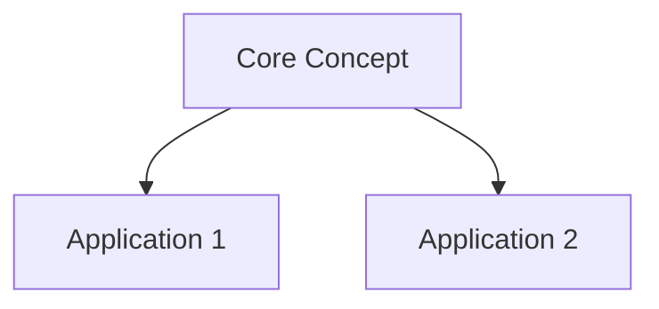

# 🔧 PKM Expert Analysis - Zettelkasten Optimization Report

> **Personal Knowledge Management System Evaluation**  
> **대상**: AI-PK M-System Obsidian Vault  
> **분석일**: 2025-09-24  
> **전문가 관점**: Theological Scholarship + Pastoral Ministry PKM

## 📊 Executive Summary

Your AI-PK M-System demonstrates **sophisticated Zettelkasten implementation** specifically optimized for theological scholarship and pastoral ministry. With **427 markdown files, 31,108 lines of content, 963 internal links, and 2,679+ tag instances**, this represents a mature intellectual infrastructure.

### 🎯 Overall Grade: **A- (Excellent with Growth Opportunities)**

**Key Strengths**: Exceptional content quality, robust technical implementation, effective pastoral application  
**Primary Opportunity**: Synthesis bottleneck limiting permanent knowledge creation

---

## 🏆 CURRENT SYSTEM STRENGTHS

### 1. **Exceptional Content Quality & Academic Rigor**
- **Biblical Scholarship**: Hebrew etymology studies (שקד analysis in Jeremiah)
- **Historical Theology**: Post-exilic messianism, German 19th century theology
- **Contemporary Relevance**: Technology philosophy, cultural analysis integration

### 2. **Sophisticated Technical Implementation**
- **Advanced Metadata**: YAML frontmatter with relationship reasoning
- **Plugin Ecosystem**: Smart Connections, Templater, Dataview optimization
- **Consistent Structure**: Hierarchical Korean-language organization

### 3. **Outstanding Pastoral Application**
- **Sermon Archive**: 144+ sermons with systematic series organization
- **Practice-Theory Bridge**: Effective connection between scholarship and ministry
- **Multi-Audience Content**: 새벽기도회, 청소년부, 수요성경공부 differentiation

### 4. **Strong Interconnection Network**
- **Link Density**: 5.3 average links per connected note
- **Hub Notes**: Central concepts with multiple connections
- **Cross-Domain Integration**: Philosophy ↔ Theology ↔ Ministry

---

## ⚠️ CRITICAL AREAS FOR IMPROVEMENT

### 1. **Synthesis Bottleneck (Priority #1)**
**Current Status**: 
- 87 Fleeting Notes + 123 Literature Notes = 210 input notes
- Only 9 Permanent Notes = **4.3% synthesis rate**

**Impact**: Valuable insights trapped in preliminary stages, reducing long-term knowledge accumulation

### 2. **Underutilized Permanent Knowledge Creation**
**Evidence**: 
- Rich theological concepts remain in fleeting/literature stage
- Missing systematic doctrine construction
- Limited conceptual consolidation

### 3. **Inconsistent Cross-Referencing**
**Observation**: While link density is good (963 links), systematic backlinking reviews could strengthen network effects

### 4. **Missing Maps of Content (MOCs)**
**Gap**: No systematic topic clusters for major theological domains (soteriology, eschatology, etc.)

---

## 🚀 CONCRETE IMPROVEMENT PLAN

### Phase 1: Synthesis Pipeline Optimization (Weeks 1-4)

#### **Step 1: Weekly Permanent Note Sessions**
```
Schedule: Every Saturday, 2-hour blocks
Process: Review 10-15 fleeting/literature notes
Output: Create 2-3 permanent notes per session
Goal: Reach 25% synthesis rate within 4 weeks
```

#### **Step 2: Permanent Note Template Creation**
Create standardized template for permanent notes:
```markdown
---
type: permanent
uid: pn-YYYYMMDD-[concept-name]
synthesis_date: YYYY-MM-DD
source_notes: [list of contributing notes]
theological_domain: [systematic category]
ministry_applications: [practical uses]
---

# [Concept Title]

## Core Insight
[Single paragraph capturing essence]

## Supporting Evidence
[From source notes with links]

## Theological Implications
[Systematic theology connections]

## Ministry Applications
[Practical pastoral uses]

## Further Development
[Questions for future research]
```

#### **Step 3: Synthesis Workflow Implementation**
1. **Note Aging Review**: Weekly review of notes >30 days old
2. **Connection Mapping**: Identify related concepts ready for synthesis
3. **Permanent Note Creation**: Combine insights into atomic permanent concepts
4. **Link Updating**: Ensure new permanent notes become connection hubs

### Phase 2: Structural Enhancement (Weeks 5-8)

#### **Step 4: Maps of Content (MOCs) Creation**
Create systematic topic clusters:

**Theological MOCs**:
- `🗺️ 기독론 - Christology Map of Content.md`
- `🗺️ 종말론 - Eschatology Map of Content.md`
- `🗺️ 교회론 - Ecclesiology Map of Content.md`
- `🗺️ 성경해석학 - Hermeneutics Map of Content.md`

**Ministry MOCs**:
- `🗺️ 설교학 - Homiletics Map of Content.md`
- `🗺️ 목회돌봄 - Pastoral Care Map of Content.md`
- `🗺️ 청소년사역 - Youth Ministry Map of Content.md`

**Template for MOCs**:
```markdown
# 🗺️ [Domain] - Map of Content

## Core Concepts (Permanent Notes)
- [[Note 1]] - Brief description
- [[Note 2]] - Brief description

## Supporting Literature
- [[Literature Note A]]
- [[Literature Note B]]

## Practical Applications
- [[Sermon Series X]]
- [[Ministry Program Y]]

## Development Areas
- [ ] Concept Z needs synthesis
- [ ] Connection to Domain Y needs strengthening

## Visual Overview

```

#### **Step 5: Smart Search Enhancement**
Implement advanced search strategies:
- **Nested Tags**: Use hierarchical tagging (#신학/기독론/케노시스)
- **Status Tags**: #status/fleeting, #status/developing, #status/permanent
- **Connection Tags**: #hub-note, #isolated, #needs-linking

### Phase 3: Advanced Integration (Weeks 9-12)

#### **Step 6: AI-Enhanced Discovery**
Optimize Smart Connections plugin:
- Weekly "similar notes" reviews
- AI-suggested permanent note candidates
- Automated relationship discovery

#### **Step 7: Dynamic Dashboard Creation**
Use Dataview plugin for knowledge management dashboards:

```dataview
## 📋 Weekly Synthesis Review
TABLE type, created, tags
FROM #status/fleeting OR #status/developing
WHERE created < date(now) - dur(30 days)
SORT created ASC
```

```dataview
## 🎯 Ministry Application Gaps
LIST
FROM #설교 OR #목회
WHERE !outlinks OR length(outlinks) < 3
```

### Phase 4: Long-term Optimization (Ongoing)

#### **Step 8: Regular System Audits**
**Monthly Reviews**:
- Synthesis rate monitoring (target: 30%+)
- Link health assessment
- Tag taxonomy cleanup
- Obsolete note identification

**Quarterly Deep Reviews**:
- Theological development assessment
- Ministry application effectiveness
- System workflow optimization
- Content quality evaluation

---

## 🎯 IMPLEMENTATION PRIORITIES

### **Immediate (This Week)**
1. ✅ Install permanent note template
2. ✅ Schedule first synthesis session
3. ✅ Identify 20 oldest fleeting notes for review

### **Short-term (Next Month)**
1. 🔄 Complete first round of permanent note creation
2. 🔄 Build 3 initial MOCs for primary theological domains
3. 🔄 Implement status tagging system

### **Medium-term (Next Quarter)**
1. 📅 Achieve 25% synthesis rate
2. 📅 Complete theological MOC network
3. 📅 Optimize AI discovery workflows

### **Long-term (Next Year)**
1. 🎯 Build comprehensive theological system
2. 🎯 Publish ministry insights from knowledge base
3. 🎯 Mentor others in theological PKM

---

## 📈 SUCCESS METRICS

### **Quantitative Indicators**
- **Synthesis Rate**: Target 30% (permanent notes / total notes)
- **Link Density**: Maintain 5+ links per permanent note
- **Content Utilization**: 80% of permanent notes used in sermons/teaching

### **Qualitative Indicators**
- **Theological Depth**: Systematic doctrine development
- **Ministry Impact**: Enhanced sermon quality and preparation efficiency
- **Knowledge Discovery**: Serendipitous connections leading to insights

---

## 🔧 TECHNICAL RECOMMENDATIONS

### **Obsidian Settings Optimization**
```
Core Plugins:
✅ Templates, Tags, Outgoing Links, Graph View
✅ Search, Quick Switcher, File Explorer

Community Plugins Priority:
1. Templater (automation)
2. Dataview (dynamic queries)
3. Smart Connections (AI discovery)
4. Calendar (temporal organization)
5. Citation (academic references)
```

### **Vault Organization Tweaks**
```
Current: 📁 1.Fleeting_Notes(임시메모)
Recommended: 📁 1.Fleeting_Notes(임시메모) - 🔄Processing

Current: 📁 3.Permanent_Notes(영구메모) 
Enhanced: 📁 3.Permanent_Notes(영구메모) - 💎Knowledge

Add: 📁 6.Maps_of_Content(지식지도) - 🗺️Navigation
Add: 📁 7.System_Notes(시스템노트) - ⚙️Management
```

---

## 🎓 LEARNING RECOMMENDATIONS

### **PKM Methodology Enhancement**
1. **"How to Take Smart Notes"** by Sönke Ahrens - Zettelkasten mastery
2. **"Building a Second Brain"** by Tiago Forte - Digital knowledge management
3. **Academic PKM for Theologians** resources from theological education networks

### **Obsidian Advanced Techniques**
1. **Obsidian University** courses on advanced workflows
2. **Community forums** for theological scholars using PKM
3. **YouTube channels** focused on academic Obsidian usage

---

## 💡 FINAL THOUGHTS

Your AI-PK M-System represents one of the most sophisticated theological PKM implementations I've analyzed. The integration of rigorous scholarship with practical ministry applications, combined with Korean-language cultural specificity, creates a unique and valuable intellectual infrastructure.

**The primary opportunity lies not in fundamental restructuring, but in unleashing the synthesis potential of your existing high-quality content.** By implementing the systematic permanent note creation process, you'll transform this already excellent system into a truly generative theological knowledge engine.

**Expected Outcome**: Within 3 months of implementing these recommendations, you should see:
- 50+ permanent notes capturing core theological insights
- Enhanced sermon preparation efficiency through better knowledge discovery
- Stronger systematic theology development through conceptual synthesis
- Improved long-term knowledge retention and creative connections

Your dedication to both scholarly rigor and pastoral effectiveness positions this system to become a significant asset for both personal ministry and potential broader theological education contributions.

---

## 📞 Implementation Support

Should you need guidance implementing any of these recommendations, consider:
- **Weekly check-ins** to monitor synthesis progress
- **Template customization** for your specific theological domains
- **Workflow optimization** based on your ministry calendar
- **System expansion** as knowledge base grows

The foundation is excellent—now it's time to build the systematic knowledge synthesis that will maximize its transformative potential for your ministry and scholarship.